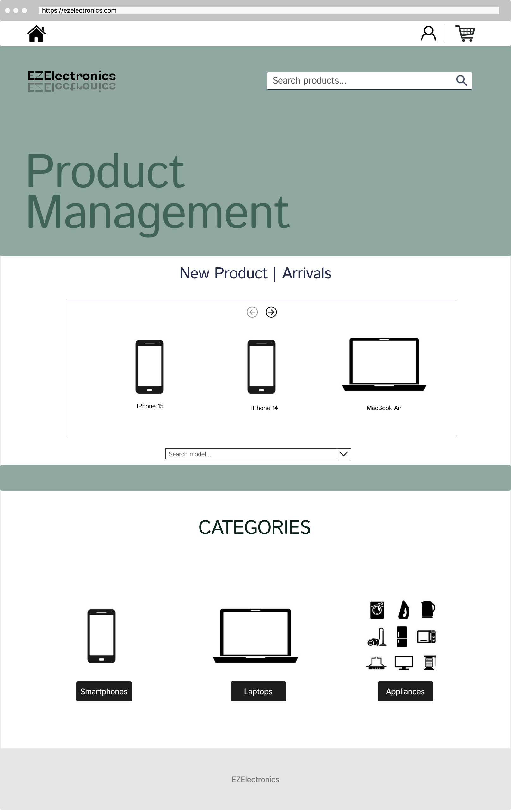

# Graphical User Interface Prototype - CURRENT

Authors: 

Date: 01-05-2025

Version: V1 - CURRENT

| Version number |           Change           |
|:--------------:|:--------------------------:|
|      1.0       | Add GUI based on use cases | 

### Create account, UC1
##### Scenario 1.1, Scenario 1.2 (create account as customer or manager)

##### Scenario 1.3 (username already exists)

### Login, UC2

### Log out, UC3

### Current session info, UC4

##### Scenario 4.1

### Create product, UC5

##### Scenario 5.1

##### Scenario 5.3

### Mark product as sold UC6

##### Scenario 6.1, 6.2

##### Scenario 6.4, 6.5 (invalid selling date)

### Get products, UC7

##### Scenario 7.1 
#### As a customer

##### Scenario 7.2 (by category)

###### Scenario 7.4 (by category and sold status)

##### Scenario 7.3 (by model)

##### Scenario 7.7 (by code)
#### As a customer 

#### As a manager

##### Scenario 7.6

##### Scenario 7.3

### Delete product by code, UC8

### Manage cart, UC9

##### Scenario 9.1

##### Scenario 9.4

### Pay for cart, UC10
## Scenario 10.2

