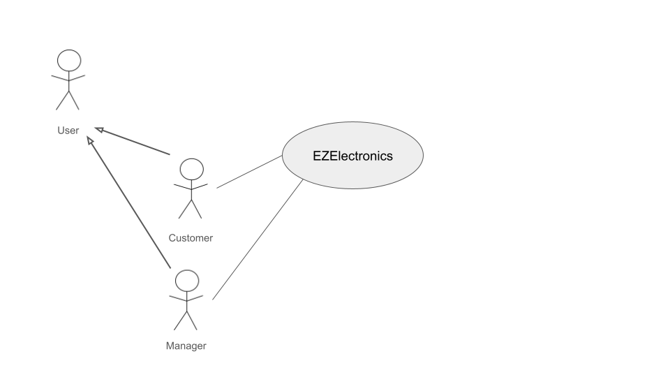
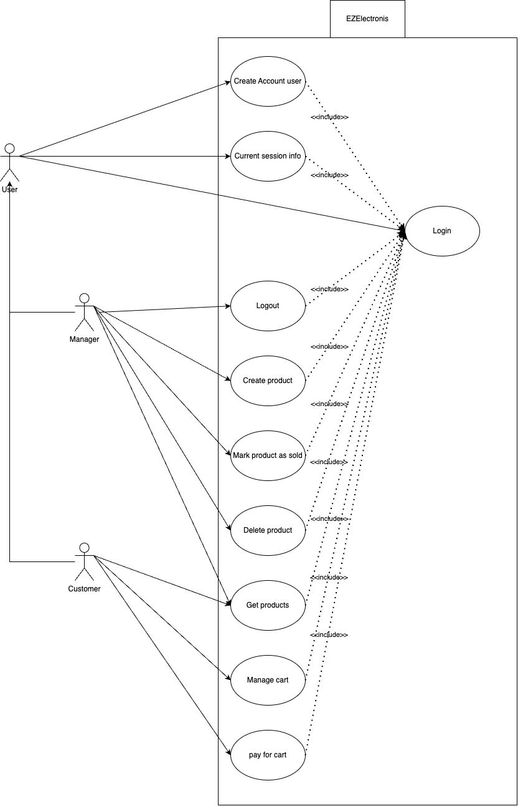

# Requirements Document - current EZElectronics

Date:

Version: V1—description of EZElectronics in CURRENT form (as received by teachers)

| Version number |                                     Change                                      |
|:--------------:|:-------------------------------------------------------------------------------:|
|      1.0       | Add Stakeholder, Stories and Personas, Functional and Non Function requirements |
|      1.1       |                         Add context diagram and images                          |
|      1.2       |                           Add use cases and glossary                            |
|      1.3       |                                Add GUI Prototype                                |
|      1.4       |                           Finish Requirement document                           |

# Contents

- [Requirements Document - current EZElectronics](#requirements-document---current-ezelectronics)
- [Contents](#contents)
- [Informal description](#informal-description)
- [Stakeholders](#stakeholders)
- [Context Diagram and interfaces](#context-diagram-and-interfaces)
    - [Context Diagram](#context-diagram)
    - [Interfaces](#interfaces)
- [Stories and personas](#stories-and-personas)
- [Table of access rights](#table-of-access-rights)
- [Functional and non functional requirements](#functional-and-non-functional-requirements)
    - [Functional Requirements](#functional-requirements)
    - [Non Functional Requirements](#non-functional-requirements)
- [Use case diagram and use cases](#use-case-diagram-and-use-cases)
    - [Use case diagram](#use-case-diagram)
    - [Use cases](#use-cases)
- [Glossary](#glossary)
- [System Design](#system-design)
- [Deployment Diagram](#deployment-diagram)

# Informal description

EZElectronics (read EaSy Electronics) is a software application designed to help managers of electronics stores to
manage their products and offer them to customers through a dedicated website. Managers can assess the available
products, record new ones, and confirm purchases. Customers can see available products, add them to a cart and see the
history of their past purchases.

# Stakeholders

|    Stakeholder name     |                                          Description                                          |
|:-----------------------:|:---------------------------------------------------------------------------------------------:|
|          User           |    Logged in person using the website. Each User could be either a customer or a manager.     |
|        Customer         |     People using the website to buy electronics products from electronics store managers      |
|         Manager         | People who are electronics store managers and showcase their products online and manage sales |
| EZElectronics Employees |                      (TechAdmin, Investors, Legal team, Marketing Team)                       |

# Context Diagram and interfaces

## Context Diagram

## Interfaces

|   Actor    | Logical Interface | Physical Interface |
|:----------:|:-----------------:|:------------------:|
|  Customer  |  PC, Smartphone   |        GUI         |
|  Manager   |  PC, Smartphone   |        GUI         |
| Tech Admin |  PC, Smartphone   |        GUI         |

# Stories and personas

Persona 1:

- Marco, 35 Male, with some computer science and tech background, store manager for over a decade

Story:

- Marco stumbled upon EZElectronics while searching for inventory management solutions. The user-friendly interface and
  features like automatic website updates and purchase confirmation caught Marco’s attention. With EZElectronics, Marco
  can now efficiently manage inventory, update the store's website, and provide a seamless shopping experience for
  customers.

Persona 2:

- Anna, a 28 Female, newly opened her own electronics shop, has very little time on her hands.

Story:

- Anna heard about EZElectronics from a fellow business owner and decided to give it a try. The simplicity of the
  application allowed Anna to quickly get up and running. Now, Anna can easily add new products, track inventory, and
  manage customer orders without spending hours on paperwork. EZElectronics has become an invaluable tool in helping
  Anna grow her business.

Persona 3:

- Emilia, 25 Female, a Frequent Online Shopper, is a tech enthusiast who loves to stay updated with the latest gadgets.
  With a busy schedule, Emilia prefers shopping online for convenience.

Story:

- Emilia discovered EZElectronics while browsing for new gadgets online. The user-friendly website interface and wide
  range of products caught Emilia’s attention. Now, Emilia can easily browse through available products, add them to her
  cart, and track her purchase history. With EZElectronics, Emilia enjoys a hassle-free shopping experience and can
  quickly get her hands on the latest tech gadgets.

Persona 4:

- Donald, 40 Male, Retail Operations Manager, oversees multiple electronics stores for a retail chain. With stores
  located across different regions, keeping track of inventory and managing purchases manually has become a daunting
  task.

Story:

- Donald was tasked with finding a centralized solution to streamline inventory management and online sales for the
  retail chain. After researching various options, Donald chose EZElectronics for its comprehensive features and
  scalability. With EZElectronics, Donald can now efficiently manage inventory across multiple stores, track sales
  performance, and ensure a seamless shopping experience for customers.

Persona 5:

- Lisa, 32, a Female, Stay-at-home Parent Turned Entrepreneur, has recently become a stay-at-home parent after having
  her second child. Wanting to contribute to the household income while taking care of her children, Lisa decided to
  start an online electronics store.

Story:

- Lisa faced many challenges in setting up her online store, from managing inventory to attracting customers. However,
  EZElectronics came to the rescue with its user-friendly platform and helpful features. Now, Lisa can easily manage her
  store, add new products, and fulfill orders, all while taking care of her children. EZElectronics has empowered Lisa
  to pursue her entrepreneurial dreams while balancing her family responsibilities.

# Functional and non functional requirements

## Functional Requirements

|   ID    |                        Description                        |
|:-------:|:---------------------------------------------------------:|
|   FR1   |                      Create account                       |
|  FR1.1  |                  Create customer account                  |
|  FR1.2  |                  Create manager account                   |
|   FR2   |                      Manage products                      |
|  FR2.1  |                      Create product                       |
|  FR2.2  |                     Register arrivals                     |
|  FR2.3  |                   Mark products as sold                   |
|  FR2.4  |                   Find product by code                    |
|  FR2.5  |                     Get all products                      |
| FR2.5.1 |  Get all products and filter products based on category   |
| FR2.5.2 |    Get all products and filter products based on model    |
| FR2.5.3 | Get all products and filter products based on sold status |
|  FR2.6  |                  Delete product by code                   | 
|   FR3   |             Authorization and authentication              | 
|  FR3.1  |                           Login                           | 
|  FR3.2  |                          Logout                           | 
|  FR3.3  |                 Get current session info                  | 
|   FR4   |                      Cart Management                      | 
|  FR4.1  |                         View cart                         | 
|  FR4.2  |                    Add product to cart                    |
|  FR4.3  |                 Delete product from cart                  |
|  FR4.4  |                       Pay for cart                        |
|  FR4.5  |               List and access cart history                |
|  FR4.6  |                      Delete the cart                      |

## Non Functional Requirements

|  ID  | Type (efficiency, reliability, ..) |                                                                                                          Description                                                                                                          |     Refers to     |
|:----:|:----------------------------------:|:-----------------------------------------------------------------------------------------------------------------------------------------------------------------------------------------------------------------------------:|:-----------------:|
| NFR1 |             Usability              |                                The user interface should be friendly enough so that the customers become able to navigate around the website and use all the functionalities under 15 minutes                                 | FR1,FR2, FR3, FR4 |
| NFR2 |             Efficiency             |                                                                    The page should respond and be navigable in 0.5 second regardless of network latencies.                                                                    | FR1,FR2, FR3, FR4 |
| NFR3 |             Efficiency             |                                                                                            Ram occupation should be under 300 MB.                                                                                             | FR1,FR2, FR3, FR4 |
| NFR4 |            Reliability             |                                                          Number of defects and failures during transactions should be less than 1% of the total amount of tentative.                                                          |       FR4.4       |
| NFR5 |            Portability             | Should be available as a web app (and have proper browser support and possibility to be viewed on old machines) Universal/legacy browser compatibility: Chrome 123.0.0, Firefox 125.0.1,  Safari 17.4.1, Internet explorer 11 | FR1,FR2, FR3, FR4 |

# Use case diagram and use cases

## Use case diagram

## Use cases

### Create Account user, UC1 - FR1

| Actors Involved  |                             User                              |
|:----------------:|:-------------------------------------------------------------:|
|   Precondition   |                  User does not have account                   |
|  Post condition  |                               -                               |
| Nominal Scenario |            Scenario 1.1 (create customer account)             |
|     Variants     |             Scenario 1.2 (create manager account)             |
|    Exceptions    | Scenario 1.3 (username exists), Scenario 1.4 (invalid inputs) |

##### Scenario 1.1 (create customer account) - FR1.2

|  Scenario 1.1  |                                                               |
|:--------------:|:-------------------------------------------------------------:|
|  Precondition  |                  user does not have account                   |
| Post condition |                   user has customer account                   |
|     Step#      |                          Description                          |
|       1        |                  user selects role customer                   |
|       2        |       user enters username, name, surname and password        |
|       3        | system searches for username in database, duplicate not found |
|       4        |     input fields are validated, constraints are satisfied     |
|       5        |        FR1.1: customer account is created for the user        |

##### Scenario 1.2 (create manager account) - FR1.1

|  Scenario 1.2  |                                                               |
|:--------------:|:-------------------------------------------------------------:|
|  Precondition  |                  user does not have account                   |
| Post condition |                   user has manager account                    |
|     Step#      |                          Description                          |
|       1        |                   user selects role Manager                   |
|       2        |       user enters username, name, surname and password        |
|       3        | system searches for username in database, duplicate not found |
|       4        |     input fields are validated, constraints are satisfied     |
|       5        |        FR1.2: manager account is created for the user         |

##### Scenario 1.3 (username exists)

|  Scenario 1.3  |                                                               |
|:--------------:|:-------------------------------------------------------------:|
|  Precondition  |                  user does not have account                   |
| Post condition |                  user does not have account                   |
|     Step#      |                          Description                          |
|       1        |                   user selects role Manager                   |
|       2        |       user enters username, name, surname and password        |
|       3        | system searches for username in database, duplicate not found |
|       4        |  system shows error saying that the username already exists   |
|       5        |             user remains in account creation page             |

##### Scenario 1.4 (invalid inputs)

|  Scenario 1.4  |                                                                 |
|:--------------:|:---------------------------------------------------------------:|
|  Precondition  |                   user does not have account                    |
| Post condition |                   user does not have account                    |
|     Step#      |                           Description                           |
|       1        |                    user selects role Manager                    |
|       2        |        user enters username, name, surname and password         |
|       3        |  system searches for username in database, duplicate not found  |
|       4        |   system shows error saying that the username already exists    |
|       5        | show error saying that there are problems with the input fields |
|       6        |              user remains in account creation page              |

### Login, UC2 - FR3.1

| Actors Involved  |                       User                       |
|:----------------:|:------------------------------------------------:|
|   Precondition   |                user not logged in                |
|  Post condition  |                        -                         |
| Nominal Scenario |                   Scenario 2.1                   |
|     Variants     |                        -                         |
|    Exceptions    | Scenario 2.2 (username and password don't match) |

##### Scenario 2.1

|  Scenario 2.1  |                                                                  |
|:--------------:|:----------------------------------------------------------------:|
|  Precondition  |                        user not logged in                        |
| Post condition |                          user logged in                          |
|     Step#      |                           Description                            |
|       1        |                user inputs username and password                 |
|       2        | database searched for username, check password, password matched |
|       3        |                    FR3.1: user gets logged in                    |

##### Scenario 2.2 (username and password don't match)

|  Scenario 2.2  |                                                                        |
|:--------------:|:----------------------------------------------------------------------:|
|  Precondition  |                           user not logged in                           |
| Post condition |                           user not logged in                           |
|     Step#      |                              Description                               |
|       1        |                   user inputs username and password                    |
|       2        | database searched for username, check password, password doesn't match |
|       3        |                      user does not get logged in                       |

### Logout, UC3 - FR3.2

| Actors Involved  |        User        |
|:----------------:|:------------------:|
|   Precondition   |   user logged in   |
|  Post condition  | user not logged in |
| Nominal Scenario |    Scenario 3.1    |
|     Variants     |         -          |
|    Exceptions    |         -          |

##### Scenario 3.1 - FR3.2

|  Scenario 3.1  |                            |
|:--------------:|:--------------------------:|
|  Precondition  |       user logged in       |
| Post condition |     user not logged in     |
|     Step#      |        Description         |
|       1        | user asks to be logged out |
|       2        | FR3.2:user gets logged out |

### Current session info, UC4 - FR3.3

| Actors Involved  |                    User                    |
|:----------------:|:------------------------------------------:|
|   Precondition   |               user logged in               |
|  Post condition  | user receives information on their session |
| Nominal Scenario |                Scenario 4.1                |
|     Variants     |                     -                      |
|    Exceptions    |                     -                      |

##### Scenario 4.1 - FR3.3

|  Scenario 4.1  |                                               |
|:--------------:|:---------------------------------------------:|
|  Precondition  |                user logged in                 |
| Post condition |  user receives information on their session   |
|     Step#      |                  Description                  |
|       1        |     user asks to get current session info     |
|       2        | FR3.3:user receives their profile information |

### Create product , UC5 - FR2.1

| Actors Involved  |                                                                                        Manager                                                                                         |
|:----------------:|:--------------------------------------------------------------------------------------------------------------------------------------------------------------------------------------:|
|   Precondition   |                                                                               user logged in as Manager                                                                                |
|  Post condition  |                                                                                                                                                                                        |
| Nominal Scenario |                                                                                      Scenario 5.1                                                                                      |
|     Variants     |                     Scenario 5.2 (create product, without arrival date), Scenario 5.3 (register arrivals), Scenario 5.4 (register arrivals, without arrival date)                      |
|    Exceptions    | Scenario 5.5(create product, already existing code), Scenario 5.6(create product, arrival date after current date) , Scenario 5.7 (Register arrivals, arrival date after current date) |

##### Scenario 5.1

|  Scenario 5.1  |                                                                                      |
|:--------------:|:------------------------------------------------------------------------------------:|
|  Precondition  |                              user logged in as Manager                               |
| Post condition |                                  product is created                                  |
|     Step#      |                                     Description                                      |
|       1        | user inserts product info: code, sellingPrice, model, category, details, arrivalDate |
|       2        |                      system checks code, does not already exist                      |
|       3        |            system checks arrival date, exists and is before current date             |
|       4        |                  system checks fields, they comply with constraints                  |
|       5        |                                FR2.1:product created                                 |

##### Scenario 5.2 (create product, without arrival date)

|  Scenario 5.2  |                                                                         |
|:--------------:|:-----------------------------------------------------------------------:|
|  Precondition  |                        user logged in as Manager                        |
| Post condition |                           product is created                            |
|     Step#      |                               Description                               |
|       1        | User inserts product info: code, sellingPrice, model, category, details |
|       2        |               system checks code, does not already exists               |
|       3        |               system checks arrival date, does not exist                |
|       4        |                system sets arrival date to current date                 |
|       5        |           system checks fields, they comply with constraints            |
|       6        |                          FR2.1:product created                          |

##### Scenario 5.3 (register arrivals) - FR2.2

|  Scenario 5.3  |                                                                                                     |
|:--------------:|:---------------------------------------------------------------------------------------------------:|
|  Precondition  |                                      user logged in as Manager                                      |
| Post condition |                                       arrivals are registered                                       |
|     Step#      |                                             Description                                             |
|       1        | manager inserts arrival product info: model, sellingPrice, category, details, arrivalDate, quantity |
|       3        |                    system checks arrival date, exists and is before current date                    |
|       4        |                         system checks fields, they comply with constraints                          |
|       5        |                                      FR2.2:arrival registered                                       |

##### Scenario 5.4 (register arrivals, without arrival date)

|  Scenario 5.4  |                                                                                        |
|:--------------:|:--------------------------------------------------------------------------------------:|
|  Precondition  |                               user logged in as Manager                                |
| Post condition |                                arrivals are registered                                 |
|     Step#      |                                      Description                                       |
|       1        | manager inserts arrival product info: model, category, sellingPrice, details, quantity |
|       3        |                       system checks arrival date, does not exist                       |
|       4        |                        system sets arrival date to current date                        |
|       5        |                   system checks fields, they comply with constraints                   |
|       6        |                               FR2.2:arrivals registered                                |

##### Scenario 5.5 (create product, already existing code)

|  Scenario 5.5  |                                                                                      |
|:--------------:|:------------------------------------------------------------------------------------:|
|  Precondition  |                              user logged in as Manager                               |
| Post condition |                                product is not created                                |
|     Step#      |                                     Description                                      |
|       1        | User inserts product info: code, sellingPrice, model, category, details, arrivalDate |
|       2        |                          system checks code, already exists                          |
|       3        |                   system shows error that the code already exists                    |
|       4        |                 product not added, user remains on add product page                  |

##### Scenario 5.6 (create product, arrival date after current date)

|  Scenario 5.6  |                                                                                      |
|:--------------:|:------------------------------------------------------------------------------------:|
|  Precondition  |                              user logged in as Manager                               |
| Post condition |                                product is not created                                |
|     Step#      |                                     Description                                      |
|       1        | User inserts product info: code, sellingPrice, model, category, details, arrivalDate |
|       2        |                     system checks code, does not already exists                      |
|       3        |                  system checks arrival date, is after current date                   |
|       4        |                  system shows error that the arrivalDate is invalid                  |
|       5        |                 product not added, user remains on add product page                  |

##### Scenario 5.7 (register arrivals, arrival date after current date)

|  Scenario 5.7  |                                                                                                     |
|:--------------:|:---------------------------------------------------------------------------------------------------:|
|  Precondition  |                                      user logged in as Manager                                      |
| Post condition |                                         products are added                                          |
|     Step#      |                                             Description                                             |
|       1        | manager inserts arrival product info: model, category, sellingPrice, details, arrivalDate, quantity |
|       3        |                    system checks arrival date, exists and is after current date                     |
|       4        |                    system shows error describing that the arrivalDate is invalid                    |
|       5        |                      arrivals not registered, user remains on add product page                      |

### Mark product as sold, UC6 - FR2.3

| Actors Involved  |                                                                                   Manager                                                                                   |
|:----------------:|:---------------------------------------------------------------------------------------------------------------------------------------------------------------------------:|
|   Precondition   |                                                                          user logged in as manager                                                                          |
|  Post condition  |                                                                                      -                                                                                      |
| Nominal Scenario |                                                              Scenario 6.1 (product exists, valid selling date)                                                              |
|     Variants     |                                                                     Scenario 6.2 (without selling date)                                                                     |
|    Exceptions    | Scenario 6.3 (product does not exist), Scenario 6.4 (selling date before arrival date), Scenario 6.5 (selling date after current date), Scenario 6.6 (product already sold) |

##### Scenario 6.1 (product exists, valid selling date)

|  Scenario 6.1  |                                                                                        |
|:--------------:|:--------------------------------------------------------------------------------------:|
|  Precondition  |                               user logged in as manager                                |
| Post condition |                                 product marked as sold                                 |
|     Step#      |                                      Description                                       |
|       1        |                     manager searches for product by code, finds it                     |
|       2        |                               manager sets selling date                                |
|       3        |                        manager attempts to mark product as sold                        |
|       4        |                  system checks if the selling date is provided, it is                  |
|       5        | system checks if selling date is after arrival date and before the current date, it is |
|       6        |               system checks that the product is already sold, it is not                |
|       7        |                            FR2.3: product is marked as sold                            |

##### Scenario 6.2 (without selling date)

|  Scenario 6.2  |                                                               |
|:--------------:|:-------------------------------------------------------------:|
|  Precondition  |                   user logged in as manager                   |
| Post condition |                    product marked as sold                     |
|     Step#      |                          Description                          |
|       1        |        manager searches for product by code, finds it         |
|       2        |           manager attempts to mark product as sold            |
|       3        |   system checks if the selling date is provided, it is not    |
|       4        |            system sets sellingDate to current date            |
|       5        | the system checks that the product is already sold, it is not |
|       6        |               FR2.3: product is marked as sold                |

##### Scenario 6.3 (product does not exist)

|  Scenario 6.3  |                                                                |
|:--------------:|:--------------------------------------------------------------:|
|  Precondition  |                   user logged in as manager                    |
| Post condition |                   product not marked as sold                   |
|     Step#      |                          Description                           |
|       1        | manager search for product by code, finds it, does not find it |
|       2        |                 product is not marked as sold                  |

##### Scenario 6.4 (selling date before arrival date)

|  Scenario 6.4  |                                                                                            |
|:--------------:|:------------------------------------------------------------------------------------------:|
|  Precondition  |                                 user logged in as manager                                  |
| Post condition |                                 product not marked as sold                                 |
|     Step#      |                                        Description                                         |
|       1        |                       manager searches for product by code, finds it                       |
|       2        |                                 manager sets selling date                                  |
|       3        |                          manager attempts to mark product as sold                          |
|       4        |                    system checks if the selling date is provided, it is                    |
|       5        | system checks if selling date is after arrival date and before the current date, it is not |
|       6        |              system shows error that the selling date is before arrival date               |
|       7        |               the system checks that the product is already sold, it is not                |
|       8        |                               product is not marked as sold                                |

##### Scenario 6.5 (selling date after current date)

|  Scenario 6.5  |                                                                                            |
|:--------------:|:------------------------------------------------------------------------------------------:|
|  Precondition  |                                 user logged in as manager                                  |
| Post condition |                                 product not marked as sold                                 |
|     Step#      |                                        Description                                         |
|       1        |                       manager searches for product by code, finds it                       |
|       2        |                                 manager sets selling date                                  |
|       3        |                          manager attempts to mark product as sold                          |
|       4        |                    system checks if the selling date is provided, it is                    |
|       5        | system checks if selling date is after arrival date and before the current date, it is not |
|       6        |               system shows error that the selling date is after current date               |
|       7        |               the system checks that the product is already sold, it is not                |
|       8        |                               product is not marked as sold                                |

##### Scenario 6.6 (product already sold)

|  Scenario 6.5  |                                                                                        |
|:--------------:|:--------------------------------------------------------------------------------------:|
|  Precondition  |                               user logged in as manager                                |
| Post condition |                               product not marked as sold                               |
|     Step#      |                                      Description                                       |
|       1        | manager attempts to mark a product as sold via it’s code and setting it’s selling date |
|       2        |                      system checks if the product exists, it does                      |
|       3        |                  system checks if the selling date is provided, it is                  |
|       4        | system checks if selling date is after arrival date and before the current date, it is |
|       5        |               the system checks that the product is already sold, it is                |
|       6        |                             product is not marked as sold                              |

### Get products, UC7 - FR2.5

| Actors Involved  |                                                                                                                                              User (Customer or Manager)                                                                                                                                              |
|:----------------:|:--------------------------------------------------------------------------------------------------------------------------------------------------------------------------------------------------------------------------------------------------------------------------------------------------------------------:|
|   Precondition   |                                                                                                                                                    user logged in                                                                                                                                                    |
|  Post condition  |                                                                                                                                                          -                                                                                                                                                           |
| Nominal Scenario |                                                                                                                                           Scenario 7.1 (get all products)                                                                                                                                            |
|     Variants     | Scenario 7.2 (get all products and filter products based on category) ,Scenario 7.3 (get all products and filter products based on model), Scenario 7.4 (get all products and filter products based on category and sold status), Scenario 7.5 (get all products and filter products based on model and sold status) | 
|    Exceptions    |                                                                                                                                        Scenario 7.6 (product does not exists)                                                                                                                                        |

##### Scenario 7.1 (get all products)

|  Scenario 7.1  |                                   |
|:--------------:|:---------------------------------:|
|  Precondition  |          user logged in           |
| Post condition |         List all products         |
|     Step#      |            Description            |
|       1        | User requests to get all products |
|       2        | FR2.5:system returns all products |

##### Scenario 7.2 (get all products and filter products based on category)

|  Scenario 7.2  |                                                         |
|:--------------:|:-------------------------------------------------------:|
|  Precondition  |                     user logged in                      |
| Post condition |       get all products filtered based on category       |
|     Step#      |                       Description                       |
|       1        | User requests to get all products in a certain category |
|       2        |  FR2.5.1:system returns all products in that category   |

##### Scenario 7.3 (get all products and filter products based on model)

|  Scenario 7.3  |                                                      |
|:--------------:|:----------------------------------------------------:|
|  Precondition  |                    user logged in                    |
| Post condition |       get all products filtered based on model       |
|     Step#      |                     Description                      |
|       1        | User requests to see all products of a certain model |
|       2        |  FR2.5.2:system returns all products of that model   |

##### Scenario 7.4 (get all products and filter products based on category and sold status)

|  Scenario 7.4  |                                                                         |
|:--------------:|:-----------------------------------------------------------------------:|
|  Precondition  |                             user logged in                              |
| Post condition |       get all products filtered based on category and sold status       |
|     Step#      |                               Description                               |
|       1        | User requests to see all products in a certain category and sold status |
|       2        |      system returns all products in that category and sold status       |

##### Scenario 7.5 (get all products and filter products based on model and sold status)

|  Scenario 7.5  |                                                                      |
|:--------------:|:--------------------------------------------------------------------:|
|  Precondition  |                            user logged in                            |
| Post condition |       get all products filtered based on model and sold status       |
|     Step#      |                             Description                              |
|       1        | user requests to see all products of a certain model and sold status |
|       2        |      system returns all products of that model and sold status       |

##### Scenario 7.6 (product does not exists)

|  Scenario 7.6  |                                                        |
|:--------------:|:------------------------------------------------------:|
|  Precondition  |                     user logged in                     |
| Post condition |                 products not returned                  |
|     Step#      |                      Description                       |
|       1        |                User inputs product code                |
|       2        |          system searches for product by code           |
|       3        | system does not find product and returns error message |

##### Scenario 7.7 (get product by code) - FR2.4

|  Scenario 7.7  |                                           |
|:--------------:|:-----------------------------------------:|
|  Precondition  |              user logged in               |
| Post condition |           products not returned           |
|     Step#      |                Description                |
|       1        |         User inputs product code          |
|       2        |    system searches for product by code    |
|       3        | system finds product and returns its info |

### Delete product, UC8 - FR2.6

| Actors Involved  |                Manager                |
|:----------------:|:-------------------------------------:|
|   Precondition   |       user logged in as manager       |
|  Post condition  |                   -                   |
| Nominal Scenario |             Scenario 8.1              |
|     Variants     |                   -                   |
|    Exceptions    | Scenario 8.2 (product does not exist) |

##### Scenario 8.1 - FR2.6

|  Scenario 8.1  |                                           |
|:--------------:|:-----------------------------------------:|
|  Precondition  |         user logged in as manager         |
| Post condition |            product is deleted             |
|     Step#      |                Description                |
|       1        | manager inputs product code to be deleted |
|       2        |    system searches for product by code    |
|       3        | FR2.6:system finds product and deletes it |

##### Scenario 8.2 (product does not exist)

|  Scenario 8.2  |                                           |
|:--------------:|:-----------------------------------------:|
|  Precondition  |         user logged in as manager         |
| Post condition |          product is not deleted           |
|     Step#      |                Description                |
|       1        | manager inputs product code to be deleted |
|       2        |    system searches for product by code    |
|       3        |       system does not find product        |
|       4        |       system returns error message        |

### Manage cart, UC9 - FR4.1

| Actors Involved  |                                                                                                                                                                                                                                                                             Customer                                                                                                                                                                                                                                                                              |
|:----------------:|:-----------------------------------------------------------------------------------------------------------------------------------------------------------------------------------------------------------------------------------------------------------------------------------------------------------------------------------------------------------------------------------------------------------------------------------------------------------------------------------------------------------------------------------------------------------------:|
|   Precondition   |                                                                                                                                                                                                                                                                    user logged in as customer                                                                                                                                                                                                                                                                     |
|  Post condition  |                                                                                                                                                                                                                                                                                 -                                                                                                                                                                                                                                                                                 |
| Nominal Scenario |                                                                                                                                                                                                                                                                     Scenario 9.1 (View cart)                                                                                                                                                                                                                                                                      |
|     Variants     |                                                                                                                                                                                                        Scenario 9.2 (add product to cart) ,Scenario 9.3 (delete product from cart) ,Scenario 9.4 (list and access cart history), Scenario 9.9(delete cart)                                                                                                                                                                                                        |
|    Exceptions    | Scenario 9.4 (product does not exist), Scenario 9.5 (add product to cart, product is in another cart), Scenario 9.6 (add product to cart, product is in another cart) , Scenario 9.7 (add product to cart, product is sold), Scenario 9.8 (delete product from cart, product does not exist), Scenario 9.9 (delete product from cart, customer does not have cart), Scenario 9.10 (delete product from cart, product does not exist in cart), , Scenario 9.12 (delete current cart, no cart to delete), Scenario 9.13 (delete product from cart, product is sold) |

##### Scenario 9.1 (get current cart info)

|  Scenario 9.1  |                                             |
|:--------------:|:-------------------------------------------:|
|  Precondition  |         user logged in as customer          |
| Post condition |            cart info is returned            |
|     Step#      |                 Description                 |
|       1        | customer requests to see their current cart |
|       2        |          system returns cart info           |

##### Scenario 9.2 (add product to cart) — FR4.2

|  Scenario 9.2  |                                                        |
|:--------------:|:------------------------------------------------------:|
|  Precondition  |    user logged in as customer, customer has a cart     |
| Post condition |         product is added to the customer cart          |
|     Step#      |                      Description                       |
|       1        |    customer inputs product code to be added to cart    |
|       2        |  system searches for product by code, product exists   |
|       3        | system checks if product is in another cart, it is not |
|       4        |      system checks if product is sold, it is not       |
|       5        |         product is added to the customer cart          |

##### Scenario 9.3 (delete product from cart)- FR4.3

|  Scenario 9.3  |                                                                   |
|:--------------:|:-----------------------------------------------------------------:|
|  Precondition  |                    user logged in as customer                     |
| Post condition |               product is deleted from customer cart               |
|     Step#      |                            Description                            |
|       1        | customer inputs product code to be deleted from the customer cart |
|       2        |           system checks if customer has a cart, they do           |
|       3        |   system checks if product with code exists in catalog, it does   |
|       4        |         system checks that the product exists in the cart         |
|       5        |   system checks that the product is not sold already, it is not   |
|       6        |             product is deleted from the customer cart             |

##### Scenario 9.4 (get cart history) — FR4.5

|  Scenario 9.4  |                                                                    |
|:--------------:|:------------------------------------------------------------------:|
|  Precondition  |                     user logged in as customer                     |
| Post condition |                   customer cart history returned                   |
|     Step#      |                            Description                             |
|       1        |            customer requests to see their cart history             |
|       2        | system checks that customer has previously paid for carts, they do |
|       3        |                system returns customer cart history                |

##### Scenario 9.5 (add product to cart, product does not exist) — FR4.2

|  Scenario 9.5  |                                                              |
|:--------------:|:------------------------------------------------------------:|
|  Precondition  |       user logged in as customer, customer has a cart        |
| Post condition |            product is not added to customer cart             |
|     Step#      |                         Description                          |
|       1        |       customer inputs product code to be added to cart       |
|       2        | system searches for product by code, product does not exist  |
|       3        | system returns error message that the product does not exist |
|       4        |          product is not added to the customer cart           |

##### Scenario 9.6 (add product to cart, product is in another cart) — FR4.2

|  Scenario 9.6  |                                                                  |
|:--------------:|:----------------------------------------------------------------:|
|  Precondition  |         user logged in as customer, customer has a cart          |
| Post condition |              product is not added to customer cart               |
|     Step#      |                           Description                            |
|       1        |         customer inputs product code to be added to cart         |
|       2        |       system searches for product by code, product exists        |
|       3        |        system checks if product is in another cart, it is        |
|       4        | system returns error message that the product is in another cart |
|       5        |            product is not added to the customer cart             |

##### Scenario 9.7 (add product to cart, product is sold)  — FR4.2

|  Scenario 9.7  |                                                               |
|:--------------:|:-------------------------------------------------------------:|
|  Precondition  |        user logged in as customer, customer has a cart        |
| Post condition |             product is not added to customer cart             |
|     Step#      |                          Description                          |
|       1        |       customer inputs product code to be added to cart        |
|       2        |      system searches for product by code, product exists      |
|       4        |    system checks if product is in another cart, it is not     |
|       5        |            system checks if product is sold, it is            |
|       6        | system returns error message that the product is already sold |
|       7        |           product is not added to the customer cart           |

##### Scenario 9.8 (delete product from cart, product does not exist) - FR4.3

|  Scenario 9.8  |                                                                   |
|:--------------:|:-----------------------------------------------------------------:|
|  Precondition  |                    user logged in as customer                     |
| Post condition |             no product is deleted from customer cart              |
|     Step#      |                            Description                            |
|       1        | customer inputs product code to be deleted from the customer cart |
|       2        |           system checks if customer has a cart, they do           |
|       3        | system checks if product with code exists in catalog, it does not |
|       4        |   system returns error message that the product does not exist    |
|       5        |             no product is deleted from customer cart              |

##### Scenario 9.9 (delete product from cart, customer does not have cart) - FR4.3

|  Scenario 9.9  |                                                                   |
|:--------------:|:-----------------------------------------------------------------:|
|  Precondition  |                    user logged in as customer                     |
| Post condition |             no product is deleted from customer cart              |
|     Step#      |                            Description                            |
|       1        | customer inputs product code to be deleted from the customer cart |
|       2        |         system checks if customer has a cart, they do not         |
|       3        | system returns error message that the customer does not have cart |
|       4        |             no product is deleted from customer cart              |

##### Scenario 9.10 (delete product from cart, product does not exist in cart) - FR4.3

| Scenario 9.10  |                                                                               |
|:--------------:|:-----------------------------------------------------------------------------:|
|  Precondition  |                          user logged in as customer                           |
| Post condition |                   no product is deleted from customer cart                    |
|     Step#      |                                  Description                                  |
|       1        |       customer inputs product code to be deleted from the customer cart       |
|       2        |                 system checks if customer has a cart, they do                 |
|       3        |         system checks if product with code exists in catalog, it not          |
|       4        |   system returns checks if the product exists in customer cart, it does not   |
|       5        | system returns error message that the product does not exist in customer cart |
|       6        |                   no product is deleted from customer cart                    |

##### Scenario 9.11(delete current cart) - FR4.6

| Scenario 9.11  |                                                 |
|:--------------:|:-----------------------------------------------:|
|  Precondition  |           user logged in as customer            |
| Post condition |            customer cart is deleted             |
|     Step#      |                   Description                   |
|       1        | customer requests to delete their current cart  |
|       2        | system checks that customer has a cart, they do |
|       3        |        system deletes the customer cart         |

##### Scenario 9.12 (no cart to delete) - FR4.6

| Scenario 9.12  |                                                            |
|:--------------:|:----------------------------------------------------------:|
|  Precondition  |                 user logged in as customer                 |
| Post condition |                customer cart is not deleted                |
|     Step#      |                        Description                         |
|       1        |       customer requests to delete their current cart       |
|       2        |    system checks that customer has a cart, they do not     |
|       3        | system returns error message that the customer has no cart |

##### Scenario 9.13 (delete product from cart, product is sold) - FR4.3

| Scenario 9.13  |                                                                     |
|:--------------:|:-------------------------------------------------------------------:|
|  Precondition  |                     user logged in as customer                      |
| Post condition |              no product is deleted from customer cart               |
|     Step#      |                             Description                             |
|       1        |  customer inputs product code to be deleted from the customer cart  |
|       2        |            system checks if customer has a cart, they do            |
|       3        |    system checks if product with code exists in catalog, it does    |
|       4        |    system returns error message that the product does not exist     |
|       5        |      system checks that the product is not sold already, it is      |
|       6        | system returns error message that the product has already been sold |
|       5        |              no product is deleted from customer cart               |

### Pay for cart, UC10 - FR4.4

| Actors Involved  |                             Customer                              |
|:----------------:|:-----------------------------------------------------------------:|
|   Precondition   |                    user logged in as customer                     |
|  Post condition  |                                 -                                 |
| Nominal Scenario |                           Scenario 10.1                           |
|     Variants     |                                 -                                 |
|    Exceptions    | Scenario 10.2 (no cart to pay for), Scenario 10.3 (cart is empty) |

##### Scenario 10.1 - FR4.4

| Scenario 10.1  |                                                               |
|:--------------:|:-------------------------------------------------------------:|
|  Precondition  |                  user logged in as customer                   |
| Post condition |                       cart is paid for                        |
|     Step#      |                          Description                          |
|       1        | customer requests to pay for the products in the current cart |
|       2        |     FR4.1: system checks if customer has a cart, they do      |
|       3        |         system checks if the cart is empty, it is not         |
|       4        | system sets total as sum of all costs of products in the cart |
|       5        |           system sets payment date as current date            |

##### Scenario 10.2 (no cart to pay for) - FR4.4

| Scenario 10.2  |                                                               |
|:--------------:|:-------------------------------------------------------------:|
|  Precondition  |                  user logged in as customer                   |
| Post condition |                      no cart is paid for                      |
|     Step#      |                          Description                          |
|       1        | customer requests to pay for the products in the current cart |
|       2        |   FR4.1: system checks if customer has a cart, they do not    |
|       3        |  system returns error message that the customer has no cart   |
|       4        |                       cart is not paid                        |

##### Scenario 10.3 (cart is empty) - FR4.4

| Scenario 10.3  |                                                               |
|:--------------:|:-------------------------------------------------------------:|
|  Precondition  |                  user logged in as customer                   |
| Post condition |                     cart is not paid for                      |
|     Step#      |                          Description                          |
|       1        | customer requests to pay for the products in the current cart |
|       2        |     FR4.1: system checks if customer has a cart, they do      |
|       3        |        system checks if the cart is empty, it is empty        |
|       4        |      system returns error message that the cart is empty      |
|       5        |                     cart is not paid for                      |

# Glossary

- Account: An account belonging to either a customer or a manager.
- User: user of application, could be a customer or a manager.
- Customer: A user with the role of a customer.
- Role: Specify the kind of user, either customer or manager.
- Manager: A user with the role of manager, responsible for adding products to the platform.
- Product: physical object that is added to the catalog from the manager and eventually sold to the user. A product
  could be sold or not sold, if it gets sold, it will have a selling date.
- Sell: manager marks a product as sold.
- Pay: customer informs the system that he wants to buy the product(s) in his current cart. Then the manager of each
  product on that cart can allow or not allow the selling.
- Cart: collection of the products the customer wants to buy.

# Deployment Diagram

