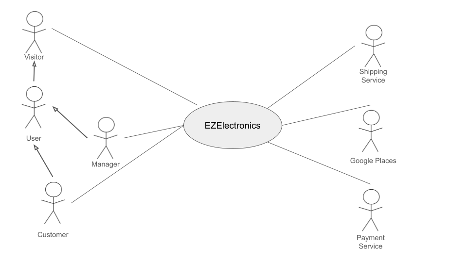
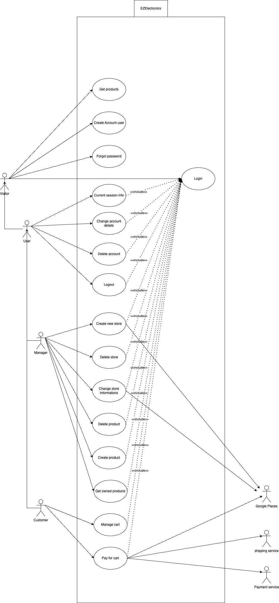

# Requirements Document - future EZElectronics

Date:

Version: V1—description of EZElectronics in FUTURE form (as proposed by the team)

| Version number |                                     Change                                      |
|:--------------:|:-------------------------------------------------------------------------------:|
|      1.0       | Add Stakeholder, Stories and Personas, Functional and Non Function requirements |
|      1.1       |                         Add context diagram and images                          |
|      1.2       |                           Add use cases and glossary                            |
|      1.3       |                                Add GUI Prototype                                |
|      1.4       |                           Finish Requirement document                           |

# Contents

- [Requirements Document - future EZElectronics](#requirements-document---future-ezelectronics)
- [Contents](#contents)
- [Informal description](#informal-description)
- [Stakeholders](#stakeholders)
- [Context Diagram and interfaces](#context-diagram-and-interfaces)
    - [Context Diagram](#context-diagram)
    - [Interfaces](#interfaces)
- [Stories and personas](#stories-and-personas)
- [Functional and non functional requirements](#functional-and-non-functional-requirements)
    - [Functional Requirements](#functional-requirements)
    - [Non Functional Requirements](#non-functional-requirements)
- [Use case diagram and use cases](#use-case-diagram-and-use-cases)
    - [Use case diagram](#use-case-diagram)
- [Glossary](#glossary)
- [System Design](#system-design)
- [Deployment Diagram](#deployment-diagram)

# Informal description

EZElectronics (read EaSy Electronics) is a software application designed to help managers of electronics stores to
manage their products and offer them to customers through a dedicated website. Managers can assess the available
products, record new ones, and confirm purchases. Customers can see available products, add them to a cart and see the
history of their past purchases.

# Stakeholders

|             Stakeholder name             |                                          Description                                          |
|:----------------------------------------:|:---------------------------------------------------------------------------------------------:|
|                   User                   |       People using the website than can be either using as customers or store managers        |
|                 Visitor                  | People who are not logged in and are visiting the website to see the products and the prices  |
|                 Customer                 |     People using the website to buy electronics products from electronics store managers      |
|                 Manager                  | People who are electronics store managers and showcase their products online and manage sales |
|         EZElectronics Employees          |                      (TechAdmin, Investors, Legal team, Marketing Team)                       |
| Regulatory agencies/ Compliance agencies |       Partner agencies that EZElectronics consults in order to comply with regulations        |
|   Product suppliers and manufacturers    |   Manufacturers of electronics products from whom the store managers obtain their products    |
|               Competitors                |                  Similar companies that have a software with the same scope                   |
|             Payment Service              | People who have invested in the company and are interested in the company's financial status  |
|             Shipping Service             |            People who are responsible for delivering the products to the customers            |
|              Google Places               |                               api for verification of addresses                               |  

# Context Diagram and interfaces

## Context Diagram

## Interfaces

|      Actor       | Logical Interface |                                                           Physical Interface                                                            |
|:----------------:|:-----------------:|:---------------------------------------------------------------------------------------------------------------------------------------:|
|     Customer     |  PC, Smartphone   |                                                                   GUI                                                                   |
|     Manager      |  PC, Smartphone   |                                                                   GUI                                                                   |
| Payment Service  |     Internet      | https://developer.paypal.com/api/rest/ , https://developer.visa.com/pages/working-with-visa-apis, https://developer.mastercard.com/apis |
| Shipping Service |     Internet      |                                                 https://www.ufficiopostale.com/api.php                                                  |
|  Google Places   |     internet      |                              https://developers.google.com/maps/documentation/places/web-service/overview                               |

# Stories and personas

Persona 1:

- Marco, 35 Male, with some computer science and tech background, store manager for over a decade

Story:

- Marco stumbled upon EZElectronics while searching for inventory management solutions. The user-friendly interface and
  features like automatic website updates and purchase confirmation caught Marco’s attention. With EZElectronics, Marco
  can now efficiently manage inventory, update the store's website, and provide a seamless shopping experience for
  customers.

Persona 2:

- Anna, a 28 Female, newly opened her own electronics shop, has very little time on her hands.

Story:

- Anna heard about EZElectronics from a fellow business owner and decided to give it a try. The simplicity of the
  application allowed Anna to quickly get up and running. Now, Anna can easily add new products, track inventory, and
  manage customer orders without spending hours on paperwork. EZElectronics has become an invaluable tool in helping
  Anna grow her business.

Persona 3:

- Emilia, 25 Female, a Frequent Online Shopper, is a tech enthusiast who loves to stay updated with the latest gadgets.
  With a busy schedule, Emilia prefers shopping online for convenience.

Story:

- Emilia discovered EZElectronics while browsing for new gadgets online. The user-friendly website interface and wide
  range of products caught Emilia’s attention. Now, Emilia can easily browse through available products, add them to her
  cart, and track her purchase history. With EZElectronics, Emilia enjoys a hassle-free shopping experience and can
  quickly get her hands on the latest tech gadgets.

Persona 4:

- Donald, 40 Male, Retail Operations Manager, oversees multiple electronics stores for a retail chain. With stores
  located across different regions, keeping track of inventory and managing purchases manually has become a daunting
  task.

Story:

- Donald was tasked with finding a centralized solution to streamline inventory management and online sales for the
  retail chain. After researching various options, Donald chose EZElectronics for its comprehensive features and
  scalability. With EZElectronics, Donald can now efficiently manage inventory across multiple stores, track sales
  performance, and ensure a seamless shopping experience for customers.

Persona 5:

- Lisa, 32, a Female, Stay-at-home Parent Turned Entrepreneur, has recently become a stay-at-home parent after having
  her second child. Wanting to contribute to the household income while taking care of her children, Lisa decided to
  start an online electronics store.

Story:

- Lisa faced many challenges in setting up her online store, from managing inventory to attracting customers. However,
  EZElectronics came to the rescue with its user-friendly platform and helpful features. Now, Lisa can easily manage her
  store, add new products, and fulfill orders, all while taking care of her children. EZElectronics has empowered Lisa
  to pursue her entrepreneurial dreams while balancing her family responsibilities.

# Functional and non functional requirements

## Functional Requirements

|   ID    |                  Description                   |
|:-------:|:----------------------------------------------:|
|   FR1   |                 Create account                 |
|  FR1.1  |            Create customer account             |
|  FR1.2  |             Create manager account             |
|   FR2   |                Manage products                 |
|  FR2.1  |                 Create product                 |
|  FR2.2  |               Register arrivals                |
|  FR2.3  |               List all  products               |
| FR2.3.1 |       filter products based on category        |
| FR2.3.2 |         filter products based on model         |
| FR2.3.3 |           get products based on code           |
|  FR2.4  |             Delete product by code             |
|  FR2.5  |            List all owned products             |
| FR2.5.1 |  filter all owned products based on category   |
| FR2.5.2 |    filter all owned products based on model    |
| FR2.5.3 |     filter all owned products already sold     |
| FR2.5.4 |       filter all owned products not sold       |
|   FR3   |        Authorization and authentication        |
|  FR3.1  |                     login                      |
|  FR3.2  |                     logout                     |
|  FR3.3  |            Get current Account Info            |
|   FR4   |                Cart Management                 |
|  FR4.1  | Access and view current cart of logged in user |
|  FR4.2  |          Add product to cart by code           |
|  FR4.3  |            Delete product from cart            |
|  FR4.5  |          List and access cart history          |
|  FR4.6  |                Delete the cart                 |
|   FR5   |                 Manage stores                  |
|  FR5.1  |               Create a new Store               |
|  FR5.2  |          Change Store’s informations           |
|  FR5.3  |                  Delete store                  |
|  FR5.4  |              Retrive owned stores              |
|   FR6   |                 Manage Account                 |
|  FR6.1  |             Change Account details             |
| FR6.1.1 |            Change Account username             |
| FR6.1.2 |              Change Account name               |
| FR6.1.3 |             Change Account surname             |
| FR6.1.4 |              Change Account email              |
| FR6.1.5 |            Change Account password             |
|  FR6.2  |                Forgot Password                 |
|  FR6.3  |                 Delete Account                 |
|   FR7   |                  Make payment                  | 
|   FR8   |                Manage shipping                 |
|  FR8.1  |             retrieve shipping cost             |
|  FR8.2  |                 verify address                 |
|  FR8.4  |      calculates commission for a purchase      |
|   FR9   |               Privacy Management               |
|  FR9.1  |             Show legal constraints             |
|  FR9.2  |              Ask user permissions              |

## Non Functional Requirements

|  ID  | Type (efficiency, reliability, ..) |                                                                                                          Description                                                                                                          |                    Refers to                    |
|:----:|:----------------------------------:|:-----------------------------------------------------------------------------------------------------------------------------------------------------------------------------------------------------------------------------:|:-----------------------------------------------:|
| NFR1 |             Usability              |                                The user interface should be friendly enough so that the customers become able to navigate around the website and use all the functionalities under 15 minutes                                 |   FR1,FR2, FR3, FR4, FR5, FR6, FR7, FR8, FR9    |
| NFR2 |             Efficiency             |                                                                    The page should respond and be navigable in 0.5 second regardless of network latencies.                                                                    | FR1,FR2, FR3, FR4, FR5, FR6, FR7, FR8, FR9, FR9 |
| NFR3 |             Efficiency             |                                                                                            Ram occupation should be under 300 MB.                                                                                             | FR1,FR2, FR3, FR4, FR5, FR6, FR7, FR8, FR9, FR9 |
| NFR4 |            Reliability             |                                                          Number of defects and failures during transactions should be less than 1% of the total amount of tentative.                                                          |                   FR7, FR9.9                    |
| NFR5 |            Portability             | Should be available as a web app (and have proper browser support and possibility to be viewed on old machines) Universal/legacy browser compatibility: Chrome 123.0.0, Firefox 125.0.1,  Safari 17.4.1, Internet explorer 11 |                FR1,FR2, FR3, FR4                |
| NFR6 |              Security              |                         payments should be made through secure payment gateways, all the data should be encrypted, and the website should be protected against SQL injection, XSS, and CSRF attacks.                          |                       FR7                       |

# Use case diagram and use cases

## Use case diagram

## Use cases

### Create Account user, UC1 - FR1

| Actors Involved  |                             User                              |
|:----------------:|:-------------------------------------------------------------:|
|   Precondition   |                  User does not have account                   |
|  Post condition  |                               -                               |
| Nominal Scenario |            Scenario 1.1 (create customer account)             |
|     Variants     |             Scenario 1.2 (create manager account)             |
|    Exceptions    | Scenario 1.3 (username exists), Scenario 1.4 (invalid fields) |

##### Scenario 1.1 (create customer account) - FR1.1

|  Scenario 1.1  |                                                                                   |
|:--------------:|:---------------------------------------------------------------------------------:|
|  Precondition  |                            User does not have account                             |
| Post condition |                             User has customer account                             |
|     Step#      |                                    Description                                    |
|       1        |                            user selects role customer                             |
|       2        |               user enters username, name, email, surname, password                |
|       3        |                  FR9.1 - System shows to user legal constraints                   |
|       4        |                       FR9.2 - System asks user permissions                        |
|       5        |                       User gives the requested permissions                        |
|       6        |           system searches for username in database, duplicate not found           |
|       7        |               input fields are validated, constraints are satisfied               |
|       8        |            system searches for email in database, duplicate not found             |
|       9        | System sends a verification code to the specified email and asks user to write it |
|       10       |                          user sends the code, right code                          |
|       11       |                    customer account gets created for the user                     |

##### Scenario 1.2 (create manager account) - FR1.2

|  Scenario 1.2  |                                                                                   |
|:--------------:|:---------------------------------------------------------------------------------:|
|  Precondition  |                            User does not have account                             |
| Post condition |                             User has manager account                              |
|     Step#      |                                    Description                                    |
|       1        |                             user selects role Manager                             |
|       2        |            user enters username, name, email, surname, password, IBAN             |
|       3        |                  FR9.1 - System shows to user legal constraints                   |
|       4        |                       FR9.2 - System asks user permissions                        |
|       5        |                       User gives the requested permissions                        |
|       6        |           system searches for username in database, duplicate not found           |
|       7        |          input fields are validated, they are conforming to constraints           |
|       8        |            system searches for email in database, duplicate not found             |
|       9        | System sends a verification code to the specified email and asks user to write it |
|       10       |                          user sends the code, right code                          |
|       11       |                     Manager account gets created for the user                     |

##### Scenario 1.3 (username exists)

|  Scenario 1.3  |                                                            |
|:--------------:|:----------------------------------------------------------:|
|  Precondition  |                 User does not have account                 |
| Post condition |                 User does not have account                 |
|     Step#      |                        Description                         |
|       1        |                 user selects role Customer                 |
|       2        |    user enters username, name, email, surname, password    |
|       3        |       FR9.1 - System shows to user legal constraints       |
|       4        |            FR9.2 - System asks user permissions            |
|       5        |            User gives the requested permissions            |
|       6        | system searches for username in database, duplicate found  |
|       7        | system shows error saying that the username already exists |
|       8        |           user remains in account creation page            |

##### Scenario 1.4 (invalid fields)

|  Scenario 1.4  |                                                                         |
|:--------------:|:-----------------------------------------------------------------------:|
|  Precondition  |                       User does not have account                        |
| Post condition |                       User does not have account                        |
|     Step#      |                               Description                               |
|       1        |                       user selects role Customer                        |
|       2        |          user enters username, name, email, surname, password           |
|       3        |             FR9.1 - System shows to user legal constraints              |
|       4        |                  FR9.2 - System asks user permissions                   |
|       5        |                  User gives the requested permissions                   |
|       6        |      system searches for username in database, duplicate not found      |
|       7        |        input fields are validated, constraints are not satisfied        |
|       8        | system shows error saying that there are problems with the input fields |
|       9        |                  user remains in account creation page                  |

##### Scenario 1.5 (email already exists)

|  Scenario 1.5  |                                                               |
|:--------------:|:-------------------------------------------------------------:|
|  Precondition  |                  User does not have account                   |
| Post condition |                  User does not have account                   |
|     Step#      |                          Description                          |
|       1        |                  user selects role customer                   |
|       2        |     user enters username, name, email, surname, password      |
|       3        |        FR9.1 - System shows to user legal constraints         |
|       4        |             FR9.2 - System asks user permissions              |
|       5        |             User gives the requested permissions              |
|       6        | system searches for username in database, duplicate not found |
|       7        |     input fields are validated, constraints are satisfied     |
|       8        |    system searches for email in database, duplicate found     |
|       9        | show error saying that the are problems with the input fields |
|       10       |             user remains in account creation page             |

##### Scenario 1.6 (wrong verification code)

|  Scenario 1.6  |                                                                                   |
|:--------------:|:---------------------------------------------------------------------------------:|
|  Precondition  |                            User does not have account                             |
| Post condition |                            User does not have account                             |
|     Step#      |                                    Description                                    |
|       1        |                            user selects role customer                             |
|       2        |               user enters username, name, email, surname, password                |
|       3        |                  FR9.1 - System shows to user legal constraints                   |
|       4        |                       FR9.2 - System asks user permissions                        |
|       5        |                       User gives the requested permissions                        |
|       6        |           system searches for username in database, duplicate not found           |
|       7        |               input fields are validated, constraitns are verified                |
|       8        |            system searches for email in database, duplicate not found             |
|       9        | System sends a verification code to the specified email and asks user to write it |
|       10       |                          user sends the code, right code                          |
|       11       |           show error saying that the are problems with the input fields           |
|       12       |                       user remains in account creation page                       |

### Login, UC2

| Actors Involved  |                       User                       |
|:----------------:|:------------------------------------------------:|
|   Precondition   |                user not logged in                |
|  Post condition  |                        -                         |
| Nominal Scenario |                   Scenario 2.1                   |
|     Variants     |                        -                         |
|    Exceptions    | Scenario 2.2 (username and password don't match) |

##### Scenario 2.1 - FR3.1

|  Scenario 2.1  |                                                           |
|:--------------:|:---------------------------------------------------------:|
|  Precondition  |                    user not logged in                     |
| Post condition |                      user logged in                       |
|     Step#      |                        Description                        |
|       1        |             user enters username and password             |
|       2        | system looks for username, exists and match with password |
|       3        |                    user gets logged in                    |

##### Scenario 2.2 (username and password don't match)

|  Scenario 2.2  |                                                               |
|:--------------:|:-------------------------------------------------------------:|
|  Precondition  |                      user not logged in                       |
| Post condition |                      user not logged in                       |
|     Step#      |                          Description                          |
|       1        |               user enters username and password               |
|       2        | system looks for username, exists but, password doesn't match |
|       3        |                  user does not get logged in                  |

### Logout, UC3

| Actors Involved  |        User        |
|:----------------:|:------------------:|
|   Precondition   |   user logged in   |
|  Post condition  | user not logged in |
| Nominal Scenario |    Scenario 3.1    |
|     Variants     |         -          |
|    Exceptions    |         -          |

##### Scenario 3.1 - FR3.2

|  Scenario 3.1  |                            |
|:--------------:|:--------------------------:|
|  Precondition  |       user logged in       |
| Post condition |     user not logged in     |
|     Step#      |        Description         |
|       1        | user asks to be logged out |
|       2        |    User gets logged out    |

### Current session info, UC4 - FR3.3

| Actors Involved  |                    User                    |
|:----------------:|:------------------------------------------:|
|   Precondition   |               user logged in               |
|  Post condition  | user receives information on their account |
| Nominal Scenario |                Scenario 4.1                |
|     Variants     |                     -                      |
|    Exceptions    |                     -                      |

##### Scenario 4.1 - FR3.3

|  Scenario 4.1  |                                            |
|:--------------:|:------------------------------------------:|
|  Precondition  |               user logged in               |
| Post condition | user receives information on their account |
|     Step#      |                Description                 |
|       1        |   user asks to get current account info    |
|       2        |  user receives their profile information   |

### Create Product , UC5

| Actors Involved  |                                                                          Manager                                                                           |
|:----------------:|:----------------------------------------------------------------------------------------------------------------------------------------------------------:|
|   Precondition   |                                                                user logged in as a manager                                                                 |
|  Post condition  |                                                                             -                                                                              |
| Nominal Scenario |                                                       Scenario 5.1, Scenario 5.6 (register arrivals)                                                       |
|     Variants     |                                                                        Scenario 5.2                                                                        |
|    Exceptions    | Scenario 5.3(product's code already exists), Scenario 5.4(inexistent store/manager doesn't possess store), Scenario 5.5 (Arrival date asfter current date) |

##### Scenario 5.1 - FR2.1

|  Scenario 5.1  |                                                                                                            |
|:--------------:|:----------------------------------------------------------------------------------------------------------:|
|  Precondition  |                                        user logged in as a Manager                                         | 
| Post condition |                                              Product created                                               |
|     Step#      |                                                Description                                                 |
|       1        | User inserts product info: sellingPrice, model, category, details, arrivalDate, store's code, image, color |
|       2        |               system checks store's code,  exists and the owner is the logged in manager, ok               |
|       3        |                           system checks arrival date, exists and is current date                           |
|       4        |                                       system validates other fields                                        |
|       5        |                      system create a new Product code which is unique for the product                      |
|       6        |                                     product added, return product code                                     |

##### Scenario 5.2

|  Scenario 5.2  |                                                                                                            |
|:--------------:|:----------------------------------------------------------------------------------------------------------:|
|  Precondition  |                                        user logged in as a Manager                                         | 
| Post condition |                                              Product created                                               |
|     Step#      |                                                Description                                                 |
|       1        | User inserts product info: sellingPrice, model, category, details, arrivalDate, store's code, image, color |
|       2        |               system checks store's code,  exists and the owner is the logged in manager, ok               |
|       3        |          system checks arrival date, does not exist and system sets arrival date to current date           |
|       4        |                                       system validates other fields                                        |
|       5        |                      system create a new Product code which is unique for the product                      |
|       6        |                                     product added, return product code                                     |

##### Scenario 5.3

|  Scenario 5.3  |                                                                                                            |
|:--------------:|:----------------------------------------------------------------------------------------------------------:|
|  Precondition  |                                        user logged in as a Manager                                         | 
| Post condition |                                            Product not created                                             |
|     Step#      |                                                Description                                                 |
|       1        | User inserts product info: sellingPrice, model, category, details, arrivalDate, store's code, image, color |
|       2        |                                 system checks store's code, doesn't exists                                 |
|       3        |                                                 Show error                                                 |

##### Scenario 5.4

|  Scenario 5.4  |                                                                                                            |
|:--------------:|:----------------------------------------------------------------------------------------------------------:|
|  Precondition  |                                        user logged in as a Manager                                         | 
| Post condition |                                            Product not created                                             |
|     Step#      |                                                Description                                                 |
|       1        | User inserts product info: sellingPrice, model, category, details, arrivalDate, store's code, image, color |
|       2        |               system checks store's code,  exists but is not owned by the logged in manager                |
|       3        |                                                 show error                                                 |

##### Scenario 5.5

|  Scenario 5.5  |                                                                                                            |
|:--------------:|:----------------------------------------------------------------------------------------------------------:|
|  Precondition  |                                        user logged in as a Manager                                         |
| Post condition |                                            Product not created                                             |
|     Step#      |                                                Description                                                 |
|       1        | User inserts product info: sellingPrice, model, category, details, arrivalDate, store's code, image, color |
|       2        |               system checks store's code,  exists and the owner is the logged in manager, ok               |
|       3        |                             system checks arrival date, is after current date                              |
|       4        |                      system shows error describing that the arrivalDate is incorrect                       |
|

##### Scenario 5.6 - FR2.2

|  Scenario 5.6  |                                                                                                                      |
|:--------------:|:--------------------------------------------------------------------------------------------------------------------:|
|  Precondition  |                                             user logged in as a Manager                                              | 
| Post condition |                                                   Products created                                                   |
|     Step#      |                                                     Description                                                      |
|       1        | User inserts product info: sellingPrice, model, category, details, arrivalDate, store's code, image, color, quantity |
|       2        |                    system checks store's code,  exists and the owner is the logged in manager, ok                    |
|       3        |                                   system checks quantity is a positive number, ok                                    |
|       4        |                                system checks arrival date, exists and is current date                                |
|       5        |                                            system validates other fields                                             |
|       6        |                           system create a new Product code which is unique for the product                           |
|       7        |                products added, system returns the informations obout the codes of the products added                 |

### Get products, UC6

| Actors Involved  |                               Visitor                                |
|:----------------:|:--------------------------------------------------------------------:|
|   Precondition   |                                  -                                   |
|  Post condition  |                                  -                                   |
| Nominal Scenario | Scenario 6.1, Scenario 6.2, Scenario 6.3, Scenario 6.4, Scenario 6.5 |
|     Variants     |                                                                      |
|    Exceptions    |                             Scenario 6.6                             |

##### Scenario 6.1 - FR2.3

|  Scenario 6.1  |                                      |
|:--------------:|:------------------------------------:|
|  Precondition  |                                      |
| Post condition |        products are returned         |
|     Step#      |             Description              |
|       1        | Visitor requests to see all products |
|       2        |  FR2.3: system returns all products  |

#### Scenario 6.2 - FR2.3

|  Scenario 6.2  |                                    |
|:--------------:|:----------------------------------:|
|  Precondition  |    User logged in as a Customer    |
| Post condition |       products are returned        |
|     Step#      |            Description             |
|       1        | user requests to see all products  |
|                | FR2.3: system returns all products |

##### Scenario 6.3 - FR2.3.1

|  Scenario 6.3  |                                                            |
|:--------------:|:----------------------------------------------------------:|
|  Precondition  |                                                            |
| Post condition |                   products are returned                    |
|     Step#      |                        Description                         |
|       1        | Visitor requests to see all products in a certain category |
|       2        |        system returns all products in that category        |

##### Scenario 6.4 - FR2.3.2

|  Scenario 6.4  |                                                         |
|:--------------:|:-------------------------------------------------------:|
|  Precondition  |                                                         |
| Post condition |                  products are returned                  |
|     Step#      |                       Description                       |
|       1        | Visitor requests to see all products of a certain model |
|       2        |        system returns all products of that model        |

##### Scenario 6.5 - FR2.3.3

|  Scenario 6.5  |                                           |
|:--------------:|:-----------------------------------------:|
|  Precondition  |                                           |
| Post condition |           products are returned           |
|     Step#      |                Description                |
|       1        | Visitor requests to get a product by code |
|       2        |  system verify if product exists, exists  |
|       3        |   system returns product's information    |

##### Scenario 6.6

|  Scenario 6.6  |                                                 |
|:--------------:|:-----------------------------------------------:|
|  Precondition  |                                                 |
| Post condition |              products are returned              |
|     Step#      |                   Description                   |
|       1        |    Visitor requests to get a product by code    |
|       2        | system verify if product exists, doesn't exists |
|       3        |                system show error                |

### Delete Product, UC7

| Actors Involved  |           Manager           |
|:----------------:|:---------------------------:|
|   Precondition   | user logged in as a manager |
|  Post condition  |                             |
| Nominal Scenario |        Scenario 7.1         |
|     Variants     |              -              |
|    Exceptions    |        Scenario 7.2         |

##### Scenario 7.1 - FR2.4

|  Scenario 7.1  |                                                                          |
|:--------------:|:------------------------------------------------------------------------:|
|  Precondition  |                       user logged in as a manager                        |
| Post condition |                            product is deleted                            |
|     Step#      |                               Description                                |
|       1        |                Manager enters product code to be deleted                 |
|       2        |               system searches for product by code (2.5.3)                |
|       3        | system verify the product is located in a store owned by the manager, ok |
|       4        |                    FR2.3: system deletes the product                     |

##### Scenario 7.2

|  Scenario 7.2  |                                             |
|:--------------:|:-------------------------------------------:|
|  Precondition  |         user logged in as a manager         |
| Post condition |           product is not deleted            |
|     Step#      |                 Description                 |
|       1        |  Manager enters product code to be deleted  |
|       2        | system searches for product by code (2.5.3) |
|       3        |        system does not find product         |
|       4        |        system returns error message         |

### Manage cart, UC8

| Actors Involved  |                                                                                                                                                   Customer                                                                                                                                                    |
|:----------------:|:-------------------------------------------------------------------------------------------------------------------------------------------------------------------------------------------------------------------------------------------------------------------------------------------------------------:|
|   Precondition   |                                                                                                                                         user logged in as a customer                                                                                                                                          |
|  Post condition  |                                                                                                                                                       -                                                                                                                                                       |
| Nominal Scenario |                                                                       Scenario 8.1 (View cart), Scenario 8.2 (add product to cart), Scenario 8.3 (delete product from cart),Scenario 8.4 (get cart history), Scenario 8.10(delete cart)                                                                       |
|     Variants     |                                                                                                                                                       -                                                                                                                                                       |
|    Exceptions    | Scenario 8.5 (product does not exist), Scenario 8.6 (add product to cart, product is in another cart), Scenario 8.7 (add product to cart, product is already sold), Scenario 8.8 (delete product from cart, product does not exists), Scenario 8.9 (delete product from cart, product does not exist in cart) |

##### Scenario 8.1 (get current cart info) - FR4.1

|  Scenario 8.1  |                                             |
|:--------------:|:-------------------------------------------:|
|  Precondition  |        user logged in as a customer         |
| Post condition |            cart info is returned            |
|     Step#      |                 Description                 |
|       1        | customer requests to see their current cart |
|       2        |          system returns cart info           |

##### Scenario 8.2 (add product to cart) — FR4.2

|  Scenario 8.2  |                                                                              |
|:--------------:|:----------------------------------------------------------------------------:|
|  Precondition  |                         user logged in as a customer                         |
| Post condition |                    product is added to the customer cart                     |
|     Step#      |                                 Description                                  |
|       1        |               customer enters product code to be added to cart               |
|       2        | system searches for product by code (FR2.3.3), product exists in the catalog |
|       3        |            system checks if product is in another cart, it is not            |
|       4        |                 system checks if product is sold, it is not                  |
|       5        |                    product is added to the customer cart                     |

##### Scenario 8.3 (delete product from cart)- FR4.3

|  Scenario 8.3  |                                                                   |
|:--------------:|:-----------------------------------------------------------------:|
|  Precondition  |                   user logged in as a customer                    |
| Post condition |               product is deleted from customer cart               |
|     Step#      |                            Description                            |
|       1        | customer enters product code to be deleted from the customer cart |
|       2        |           system searches for product by code (FR2.3.3)           |
|       3        |         system checks that the product exists in the cart         |
|       4        |   system checks that the product is not sold already, it is not   |
|       5        |             product is deleted from the customer cart             |

##### Scenario 8.4 (get cart history) — FR4.5

|  Scenario 8.4  |                                             |
|:--------------:|:-------------------------------------------:|
|  Precondition  |        user logged in as a customer         |
| Post condition |       customer cart history returned        |
|     Step#      |                 Description                 |
|       1        | customer requests to see their cart history |
|       2        |    system returns customer cart history     |

##### Scenario 8.5 (add product to cart, product does not exist)

|  Scenario 8.5  |                                                                       |
|:--------------:|:---------------------------------------------------------------------:|
|  Precondition  |                     user logged in as a customer                      |
| Post condition |                 product is not added to customer cart                 |
|     Step#      |                              Description                              |
|       1        |           customer enters product code to be added to cart            |
|       2        | system searches for product by code (FR2.3.3), product does not exist |
|       3        |     system returns error message that the product does not exist      |
|       4        |               product is not added to the customer cart               |

##### Scenario 8.6 (add product to cart, product is in another cart)

|  Scenario 8.6  |                                                                  |
|:--------------:|:----------------------------------------------------------------:|
|  Precondition  |                   user logged in as a customer                   |
| Post condition |              product is not added to customer cart               |
|     Step#      |                           Description                            |
|       1        |         customer enters product code to be added to cart         |
|       2        |   system searches for product by code(FR2.3.3), product exists   |
|       3        |        system checks if product is in another cart, it is        |
|       4        | system returns error message that the product is in another cart |
|       5        |            product is not added to the customer cart             |

##### Scenario 8.7 (add product to cart, product is sold)

|  Scenario 8.7  |                                                               |
|:--------------:|:-------------------------------------------------------------:|
|  Precondition  |                 user logged in as a customer                  |
| Post condition |             product is not added to customer cart             |
|     Step#      |                          Description                          |
|       1        |       customer enters product code to be added to cart        |
|       2        | system searches for product by code (FR2.3.3), product exists |
|       3        |    system checks if product is in another cart, it is not     |
|       4        |            system checks if product is sold, it is            |
|       5        | system returns error message that the product is already sold |
|       6        |           product is not added to the customer cart           |

##### Scenario 8.8 (delete product from cart, product does not exist)

|  Scenario 8.8  |                                                                               |
|:--------------:|:-----------------------------------------------------------------------------:|
|  Precondition  |                         user logged in as a customer                          |
| Post condition |                   no product is deleted from customer cart                    |
|     Step#      |                                  Description                                  |
|       1        |       customer enters product code to be deleted from the customer cart       |
|       2        | system search for product by code (2.5.2) , it does not exists in the catalog |
|       3        |         system returns error message that the product does not exist          |
|       4        |                   no product is deleted from customer cart                    |

##### Scenario 8.9 (delete product from cart, product does not exist in cart)

|  Scenario 8.9  |                                                                               |
|:--------------:|:-----------------------------------------------------------------------------:|
|  Precondition  |                         user logged in as a customer                          |
| Post condition |                   no product is deleted from customer cart                    |
|     Step#      |                                  Description                                  |
|       1        |       customer enters product code to be deleted from the customer cart       |
|       2        |   system search for product by code (2.5.2) , it does exists in the catalog   |
|       3        |       system checks if the product exists in customer cart, it does not       |
|       4        | system returns error message that the product does not exist in customer cart |
|       5        |                   no product is deleted from customer cart                    |

##### Scenario 8.10 (delete current cart) FR4.6

| Scenario 8.10  |                                                |
|:--------------:|:----------------------------------------------:|
|  Precondition  |          user logged in as a customer          |
| Post condition |            customer cart is deleted            |
|     Step#      |                  Description                   |
|       1        | customer requests to delete their current cart |
|       2        |        system deletes the customer cart        |

### Pay for cart, UC9

| Actors Involved  | Customer, Manager, Payment Service, Shipping Service, Google Places |
|:----------------:|:-------------------------------------------------------------------:|
|   Precondition   |                    user logged in as a customer                     |
|  Post condition  |                                                                     |
| Nominal Scenario |                            Scenario 9.1                             |
|     Variants     |                                  -                                  |
|    Exceptions    |                     Scenario 9.2, Scenario 9.3                      |

##### Scenario 9.1 - FR7

|    Scenario    |                                    9.1                                    |
|:--------------:|:-------------------------------------------------------------------------:|
|  Precondition  |                       	User logged in as a customer                       |
| Post condition |                               	Cart is sold                               |
|      Step      |                               #	Description                               |
|       1        |        	User requests to pay for the products in the current cart         |
|       2        |              	System checks if the cart is empty, it is not               |
|       3        |            	System prompts the user to input shipping address             |
|       4        |                       	User enters shipping address                       |
|       5        |             FR8.2 System verify address through Google Places             |
|       6        |    FR8.1 system retrieves shipping price through the shipping service     |
|       7        |                 	System shows the shipping price to user                  |
|       8        |                 	System asks user to confirm the purchase                 |
|       9        |                        	User confirms the purchase                        |
|       10       |                      	User selects payment platform                       |
|       11       |               	System prompts user to input payment details               |
|       12       |                       	User enters payment details                        |
|       13       |           	System sends payment details to the payment service            |
|       14       |                	System checks if the payment is successful                |
|       15       |    	System shows the user a message confirming the successful payment     |
|       16       |                	System sums the product prices for manager                |
|       17       |          FR8.4:	System calculates commission manager has to pay           |
|       18       | 	System removes the commission from the amount to be sent to the managers |
|       19       |            	System retrieves the corresponding manager's IBANs            |
|       20       |           	System makes the payment to the respective managers            |
|                |                  repeats steps 16 to 20 for each manager                  |
|       21       |     for each product in the cart set the selling date as current date     |
|       22       |                      	System marks the cart as sold                       |

##### Scenario 9.2

|    Scenario    |                            9.2                             |
|:--------------:|:----------------------------------------------------------:|
|  Precondition  |               	User logged in as a customer                |
| Post condition |                      Cart is not sold                      |
|      Step      |                       #	Description                        |
|       1        | 	User requests to pay for the products in the current cart |
|       2        |         	System checks if the cart is empty, it is         |
|       3        |    	System shows an error to the user, cart is not sold    |

##### Scenario 9.3

|    Scenario    |                             9.3                              |
|:--------------:|:------------------------------------------------------------:|
|  Precondition  |                	User logged in as a customer                 |
| Post condition |                        	Cart is sold                         |
|      Step      |                        #	Description                         |
|       1        |  	User requests to pay for the products in the current cart  |
|       2        |        	System checks if the cart is empty, it is not        |
|       3        |      	System prompts the user to input shipping address      |
|       4        |                	User enters shipping address                 |
|       5        | check if the shipping address is valid through Google Places |
|       6        |   system retrieves shipping price by the shipping service    |
|       7        |          	System asks user to confirm the purchase           |
|       8        |                 	User confirms the purchase                  |
|       9        |                	User selects payment platform                |
|       10       |        	System prompts user to input payment details         |
|       11       |                 	User enters payment details                 |
|       12       |     	System sends payment details to the payment service     |
|       13       |    	System checks if the payment is successful, it is not    |
|       14       |       System shows an error to the user, cart not sold       |

### Delete Account - UC10 FR6.3

| Actors Involved  |                User                 |
|:----------------:|:-----------------------------------:|
|   Precondition   |           User logged in            |
|  Post condition  | User not logged in, account deleted |
| Nominal Scenario |            Scenario 10.1            |
|     Variants     |                                     |
|    Exceptions    |                                     |

##### Scenario 10.1 - FR5

| Scenario 10.1  |                                     |
|:--------------:|:-----------------------------------:|
|  Precondition  |           user logged in            |
| Post condition | user not logged in, account deleted |
|     Step#      |             Description             |
|       1        | user requests to delete his account |
|       2        |     system deletes his account      |

### Forgot password, UC11

| Actors Involved  |                             User                             |
|------------------|:------------------------------------------------------------:| 
| Precondition     |                        User logged in                        |
| Post condition   |                              -                               |
| Nominal Scenario |                        Scenario 11.1                         |
| Variants         |                        Scenario 11.2                         |
| Exceptions       | Scenario 11.3(incorrect code), Scenario 11.4(user not found) |

##### Scenario 1.1 - FR6.2

| Scenario 11.1  |                                                                               |
|----------------|:-----------------------------------------------------------------------------:| 
| Precondition   |                         User logged in as a Customer                          |
| Post condition |                           Customer changed password                           |
| Step#          |                                  Description                                  |
| 1              |                      Customer requests password recovery                      |  
| 2              |                           system asks for username                            |
| 3              |                           Customer enters username                            | 
| 4              |           system get user by username(FR9.1), finds an existing one           | 
| 5              |                   system sends email with verification key                    |  
| 6              |              system requests Customer to enter verification key               |
| 7              |                     Customer enters the verification key                      |
| 8              |                    system checks key correctness, it is ok                    |
| 9              |               system asks Customer to enter their new Password                |
| 10             |      system validates the newly entered password, successful validation       |
| 11             | system shows a message to Customer saying that the password has been modified |

##### Scenario 11.2 - FR6.2

| Scenario 11.2  |                                                                              |
|----------------|:----------------------------------------------------------------------------:| 
| Precondition   |                         User logged in as a Manager                          |
| Post condition |                           Manager changed password                           |
| Step#          |                                 Description                                  |
| 1              |                      Manager requests password recovery                      |  
| 2              |                           system asks for username                           |
| 3              |                           Manager enters username                            | 
| 4              |          system get user by username(FR9.1), finds an existing one           | 
| 5              |                   system sends email with verification key                   |  
| 6              |              system requests Manager to enter verification key               |
| 7              |                     Manager enters the verification key                      |
| 8              |                   system checks key correctness, it is ok                    |
| 9              |               system asks Manager to enter their new Password                |
| 10             |      system validates the newly entered password, successful validation      |
| 11             | system shows a message to Manager saying that the password has been modified |

##### Scenario 11.3

| Scenario 11.3  |                                                                  |
|----------------|:----------------------------------------------------------------:| 
| Precondition   |               User has an account on EZelectronics               |
| Post condition |                   User didn't change password                    |
| Step#          |                           Description                            |
| 1              |                 User requests password recovery                  |  
| 1              |                     system asks for username                     |
| 3              |                       User enters username                       | 
| 4              |    system get user by username(FR9.1), finds an existing one     | 
| 5              |             system sends email with verification key             |  
| 6              |          system requests User to enter verification key          |
| 7              |                 User enters the verification key                 |
| 8              |             system checks key correctness, it is not             |
| 9              | system shows error to user, saying the verification key is wrong |

##### Scenario 11.4

| Scenario 11.4  |                                                         |
|----------------|:-------------------------------------------------------:| 
| Precondition   |          User has an account on EZelectronics           |
| Post condition |               User didn't change password               |
| Step#          |                       Description                       |
| 1              |             User requests password recovery             |  
| 2              |                system asks for username                 |
| 3              |                  User enters username                   | 
| 4              | system get user by username(FR9.1), user doesn't exists | 
| 5              |                   show error to user                    | 

### Change account details, UC12

| Actors Involved  |                                                                          User                                                                           |
|------------------|:-------------------------------------------------------------------------------------------------------------------------------------------------------:| 
| Precondition     |                                                                  User is authenticated                                                                  |
| Post condition   |                                                                                                                                                         |
| Nominal Scenario |                                        Scenario 12.1, Scenario 12.2, Scenario 12.3, Scenario 12.4, Scenario 12.5                                        |
| Variants         |                                                                      Scenario 12.6                                                                      |
| Exceptions       | Scenario 12.7(username already exists), Scenario 12.8(non-existent email), Scenario 12.9(email already used), Scenario 12.10(change password, not safe) |

##### Scenario 12.1 (change username) - FR6.1.1

| Scenario 12.1  |                                                                           |
|----------------|:-------------------------------------------------------------------------:| 
| Precondition   |                           User is authenticated                           |
| Post condition |                           User changed username                           |
| Step#          |                                Description                                |
| 1              |                     user requests to change username                      |
| 2              |                        user enters a new username                         |
| 3              |     system get user by username(FR9.1), username does not exists, ok      | 
| 4              |                  system changes username to new username                  |
| 5              | system shows a message to User saying that the username has been modified |

##### Scenario 12.2 (change name) - FR6.1.2

| Scenario 12.2  |                                                                       |
|----------------|:---------------------------------------------------------------------:| 
| Precondition   |                         User is authenticated                         |
| Post condition |                           User changed name                           |
| Step#          |                              Description                              |
| 1              |                     user requests to change name                      |
| 2              |                System requests user to input new name                 |
| 3              |                        user enters a new name                         |  
| 4              |                 system checks that name not null, ok                  | 
| 5              | system shows a message to User saying that the name has been modified |

##### Scenario 12.3 (change surname) - FR6.1.3

| Scenario 12.3  |                                                                          |
|----------------|:------------------------------------------------------------------------:| 
| Precondition   |                          User is authenticated                           |
| Post condition |                           User changed surname                           |
| Step#          |                               Description                                |
| 1              |                     User requests to change surname                      |
| 2              |                System requests user to input new surname                 |
| 3              |                        User enters a new surname                         |  
| 4              |                 system checks that surname not null, ok                  | 
| 5              | system shows a message to User saying that the surname has been modified |

##### Scenario 12.4 (change email) - FR6.1.4

| Scenario 12.4  |                                                                        |
|----------------|:----------------------------------------------------------------------:| 
| Precondition   |                         User is authenticated                          |
| Post condition |                           User changed email                           |
| Step#          |                              Description                               |
| 1              |                     User requests to change email                      |
| 2              |                System requests user to input new email                 |
| 3              |                        User enters a new e-mail                        |  
| 4              |                   search for email, not existing: ok                   | 
| 5              |                Send email to user with verification key                |  
| 6              |                        Request verification key                        |
| 7              |                    User enters the verification key                    |
| 8              |       system checks verification key correctness, it is correct        |
| 9              | system shows a message to User saying that the email has been modified |

##### Scenario 12.5 (change password) - FR6.1.5
| Scenario 12.5  |                                                                           |
|----------------|:-------------------------------------------------------------------------:| 
| Precondition   |                           User is authenticated                           |
| Post condition |                           User changed password                           |
| Step#          |                                Description                                |
| 1              |                     User requests to change password                      |
| 2              |                System requests user to input new password                 |
| 3              |                        User enters a new password                         |  
| 4              |              system validates password with safety rules, ok              | 
| 5              | system shows a message to User saying that the password has been modified |

##### Scenario 12.6 (manager, change name) - FR6.1.2
| Scenario 12.6  |                                                                  |
|----------------|:----------------------------------------------------------------:| 
| Precondition   |                     Manager is authenticated                     |
| Post condition |                       Manager changed name                       |
| Step#          |                           Description                            |
| 1              |                   User requests to change name                   |
| 2              |            System requests Manager to input new name             |
| 3              |                    Manager enters a new name                     |  
| 4              |               system checks that name not null, ok               | 
| 5              | Show a message to Manager saying that the name has been modified |

##### Scenario 12.7 (change username, username already exists)
| Scenario 12.7  |                                                                    |
|----------------|:------------------------------------------------------------------:| 
| Precondition   |                       User is authenticated                        |
| Post condition |                       username not modified                        |
| Step#          |                            Description                             |
| 1              |                  User requests to change username                  |
| 2              |             System requests user to input new username             |
| 3              |                     User enters a new username                     |  
| 4              |    system get user by username(FR9.1), username alreasy exists     | 
| 5              | system shows error to user saying that the username already exists |

##### Scenario 12.8 (change email, incorrect verification code)

| Scenario 12.8  |                                                                           |
|----------------|:-------------------------------------------------------------------------:| 
| Precondition   |                           User is authenticated                           |
| Post condition |                            email not modified                             |
| Step#          |                                Description                                |
| 1              |                       User requests to change email                       |
| 2              |                  System requests user to input new email                  |
| 3              |                          User enters a new email                          |  
| 4              |                     search for email, does not exist                      | 
| 5              |                     Send email with verification key                      |  
| 6              |                system asks user to enter verification key                 |
| 7              |                       User input a verification key                       |
| 8              |          system check verification key correctness, not correct           |
| 9              | system shows error to user saying that the verification code is incorrect |

##### Scenario 12.9 (change email, already existing )

| Scenario 12.9  |                                         |
|----------------|:---------------------------------------:| 
| Precondition   |          User is authenticated          |
| Post condition |           e-mail not modified           |
| Step#          |               Description               |
| 1              |      User requests to change email      |
| 2              | System requests user to input new email | 
| 3              |   search for email, already existing    | 
| 4              |               Show error.               |

##### Scenario 12.10 (change password, not safe)

| Scenario 12.10 |                                                          |
|----------------|:--------------------------------------------------------:| 
| Precondition   |                  User is authenticated                   |
| Post condition |                  password not modified                   |
| Step#          |                       Description                        |
| 1              |             User requests to change password             |
| 2              |        System requests user to input new password        |
| 3              | validate password with safety rules, rules not satisfied | 
| 4              |                        Show error                        |

### Create new Store, UC13

| Actors Involved  |                     Manager                     |
|------------------|:-----------------------------------------------:| 
| Precondition     | User has an account and is logged in as Manager |
| Post condition   |                        -                        |
| Nominal Scenario |                  Scenario 13.1                  |
| Variants         |                        -                        |
| Exceptions       |         Scenario 13.2(invalid address)          |

##### Scenario 13.1 - FR5.1

| Scenario 13.1  |                                                                                                                     |
|----------------|:-------------------------------------------------------------------------------------------------------------------:| 
| Precondition   |                                   User has an account and is logged in as Manager                                   |
| Post condition |                                                New Store is created                                                 |
| Step#          |                                                     Description                                                     |
| 1              |                                          Manager requests to add new store                                          |
| 2              |                                 system asks Manager to enter store name and address                                 |
| 3              |                                        Manager enters Store name and address                                        |  
| 4              |                                  FR8.2: system verifies address, address is valid                                   | 
| 5              | system shows a message to Manager saying that the new store has been Created and shows the just creted store's code |

##### Scenario 13.2 (invalid address)

| Scenario 13.2  |                                                                  |
|----------------|:----------------------------------------------------------------:| 
| Precondition   |         User has an account and is logged in as Manager          |
| Post condition |                   The new store is not created                   |
| Step#          |                           Description                            |
| 1              |                Manager requests to add new store                 |
| 2              |       system asks Manager to enter store name and address        |
| 3              |              Manager enters Store name and address               |  
| 4              |        FR8.2: system verifies address, address is invalid        | | 
| 5              | system shows error to manager saying that the address is invalid |

### Change Store information, UC14

| Actors Involved  |                             Manager                             |
|------------------|:---------------------------------------------------------------:| 
| Precondition     | User has an account, is logged in as Manager and owns the store |
| Post condition   |                                -                                |
| Nominal Scenario |                          Scenario 14.1                          |
| Variants         |                          Scenario 14.2                          |
| Exceptions       |               Scenario 14.3 (invalid new address)               |

##### Scenario 14.1 - FR5.2

| Scenario 14.1  |                                                                    |
|----------------|:------------------------------------------------------------------:| 
| Precondition   |  User has an account, is logged in as Manager and owns the store   |
| Post condition |                      Store's name is modified                      |
| Step#          |                            Description                             |
| 1              |               FR5.4 - Manager retrives owned stores                |
| 2              |      Manager requests to change the informations for a store       |
| 3              |                Manager enters the new store's name                 |  
| 4              |                         name not null, ok                          | 
| 5              | Show a message to Manager saying that the  store has been modified |

##### Scenario 14.2 - FR5.2

| Scenario 14.2  |                                                                    |
|----------------|:------------------------------------------------------------------:| 
| Precondition   |  User has an account, is logged in as Manager and owns the store   |
| Post condition |                    Store's address is modified                     |
| Step#          |                            Description                             |
| 1              |               FR5.4 - Manager retrives owned stores                |
| 2              |      Manager requests to change the informations for a store       |
| 3              |               Manager enters the new store's address               |  
| 4              |          FR8.2: system verifies address, address is valid          | 
| 5              | Show a message to Manager saying that the  store has been modified |

##### Scenario 14.3

| Scenario 14.3  |                                                                 |
|----------------|:---------------------------------------------------------------:| 
| Precondition   | User has an account, is logged in as Manager and owns the store |
| Post condition |               The store's address is not modified               |
| Step#          |                           Description                           |
| 1              |              FR5.4 - Manager retrives owned stores              |
| 2              |     Manager requests to change the informations for a store     |
| 3              |               Manager enters new store's address                |  
| 4              |        FR8.2: system verifies address, address is valid         | 
| 5              |                           Show error.                           |

### Delete Store, UC15

| Actors Involved  |                             Manager                             |
|------------------|:---------------------------------------------------------------:| 
| Precondition     | User has an account, is logged in as Manager and owns the store |
| Post condition   |                                -                                |
| Nominal Scenario |                          Scenario 15.1                          |
| Variants         |                                -                                |
| Exceptions       |                                -                                |

##### Scenario 15.1 - FR5.3

| Scenario 15.1  |                                                                 |
|----------------|:---------------------------------------------------------------:| 
| Precondition   | User has an account, is logged in as Manager and owns the store |
| Post condition |                        Store is deleted                         |
| Step#          |                           Description                           |
| 1              |              FR5.4 - Manager retrives owned stores              |
| 2              |                Manager request to delete a store                |  
| 3              |       the system retrieves all the products of that store       | 
| 4              |           F2.6:  Each product of the store is deleted           |
| 5              |                      The store is deleted                       |

### Get owned products, UC16

| Actors Involved  |                                  Manager                                  |
|:----------------:|:-------------------------------------------------------------------------:|
|   Precondition   |                        User logged in as a Manager                        |
|  Post condition  |                                     -                                     |
| Nominal Scenario | Scenario 16.1, Scenario 16.2, Scenario 16.3, Scenario 16.4, Scenario 16.5 |
|     Variants     |                                                                           |
|    Exceptions    |                                     -                                     |

#### Scenario 16.1 - FR2.5

| Scenario 16.1  |                                                     |
|:--------------:|:---------------------------------------------------:|
|  Precondition  |             User logged in as a Manager             |
| Post condition |                products are returned                |
|     Step#      |                     Description                     |
|       1        |     manager requests to see all owned products      |
|       2        | FR2.5: system returns products owned by the manager |

##### Scenario 16.2 - FR2.5.1

| Scenario 16.2  |                                                                   |
|:--------------:|:-----------------------------------------------------------------:|
|  Precondition  |                    user logged in as a Manager                    |
| Post condition |                       products are returned                       |
|     Step#      |                            Description                            |
|       1        | manager requests to see all owned products in a certain category  |
|       2        | system returns all products owned by the manager in that category |

##### Scenario 16.3 - FR2.5.2

| Scenario 16.3  |                                                                |
|:--------------:|:--------------------------------------------------------------:|
|  Precondition  |                  user logged in as a manager                   |
| Post condition |                     products are returned                      |
|     Step#      |                          Description                           |
|       1        | manager requests to see all owned products in a certain model  |
|       2        | system returns all products owned by the manager in that model |

##### Scenario 16.4 - FR2.5.3

| Scenario 16.4  |                                                                    |
|:--------------:|:------------------------------------------------------------------:|
|  Precondition  |                    user logged in as a manager                     |
| Post condition |                       products are returned                        |
|     Step#      |                            Description                             |
|       1        |      manager requests to see all owned products already sold       |
|       2        | system returns all products owned by manager that are already sold |

##### Scenario 16.5 - FR2.5.4

| Scenario 16.5  |                                                                |
|:--------------:|:--------------------------------------------------------------:|
|  Precondition  |                  user logged in as a manager                   |
| Post condition |                     products are returned                      |
|     Step#      |                          Description                           |
|       1        |      manager requests to see all owned products not sold       |
|       2        | system returns all products owned by manager that are not sold |

# Glossary

# Deployment Diagram

